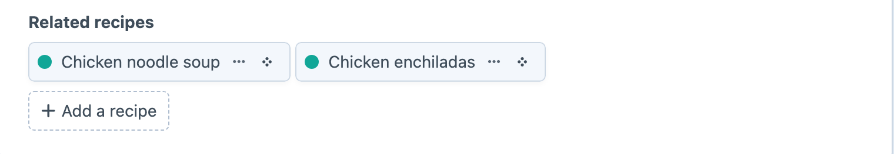
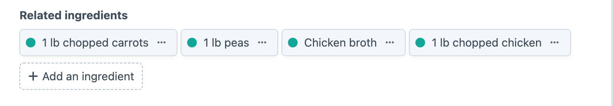

<!-- feature-intro -->
Many To Many keeps a Craft relationship editable from either side. Connect related elements once, then let authors manage the association from whichever record they are already working on.
<!-- feature-intro-end -->

<!-- feature-section media-size="large" media-shadow="false" -->
## Two-way relationships

Configure the paired element field and let the plugin synchronise changes across both sides. Authors can connect or remove related content from the place that makes sense without leaving conflicting relationship data behind.

<!-- feature-section-end -->

<!-- feature-section media-size="large" media-shadow="false" -->
## Native Craft relations

The field uses Craft’s element-selection patterns and stores real element relationships, so Twig, GraphQL and element queries can work with the selected elements in the usual way.

<!-- feature-section-end -->
